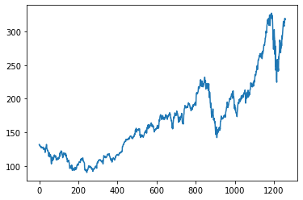
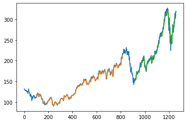
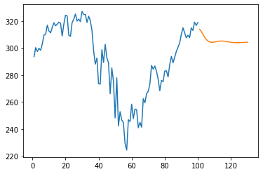
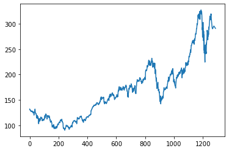

# Stock Price Prediction with a Stacked LSTM

Forecasting Apple (AAPL) daily closing prices with a three-layer stacked LSTM in TensorFlow / Keras, including a recursive 30-day forward forecast.


[](https://colab.research.google.com/github/diyasharma05/Stock_Price_Prediction/blob/main/Stock1.ipynb)

## Overview

A univariate time-series regression on about 1,250 daily closing prices (May 2015 onward). The model looks at a sliding window of the previous 100 closes to predict the next one, then rolls its own predictions forward to forecast 30 trading days beyond the end of the data.

## Pipeline

1. **Load** - daily OHLCV CSV for AAPL; keep the `close` column.
2. **Scale** - `MinMaxScaler` to [0, 1], since LSTMs are sensitive to input scale.
3. **Split** - chronological 65 / 35 train-test split (817 / 441 rows). No shuffling, so the test period lies strictly after the training period.
4. **Window** - sliding window of 100 time steps mapped to the next-day close. Training tensor shape (716, 100, 1).
5. **Train** - stacked LSTM below, MSE loss, Adam optimiser, 100 epochs, batch size 64.
6. **Evaluate** - inverse-transform predictions and plot them against the actual series.
7. **Forecast** - recursive multi-step prediction: each predicted value is appended to the window and fed back in, 30 times.

## Model

```text
LSTM(50, return_sequences=True)   input shape (100, 1)
LSTM(50, return_sequences=True)
LSTM(50)
Dense(1)
```

About 51k trainable parameters. Training loss (scaled) falls from 2.1e-2 to 1.5e-4 over 100 epochs; validation loss ends at 9.3e-4.

## Results

| Closing price history | Train (orange) and test (green) predictions over the actual series (blue) |
|---|---|
|  |  |

| 30-day forward forecast (orange) after the last 100 days | Full series with the forecast appended |
|---|---|
|  |  |

The same notebook was also run on MSFT closing prices with comparable behaviour.

## Repository contents

| File | What it is |
|---|---|
| `Stock1.ipynb` | Full notebook: loading, scaling, windowing, model, evaluation, 30-day forecast |
| `assets/` | Figures exported from the notebook |

## Running it

Open the notebook in Colab with the badge above, or locally:

```bash
pip install pandas numpy matplotlib scikit-learn tensorflow
jupyter notebook Stock1.ipynb
```

Point the `read_csv` call at any daily price CSV that has a `close` column.

## Limitations and next steps

- The RMSE cells compare scaled targets with inverse-transformed predictions, so the printed RMSE values are not on a meaningful scale. Inverse-transform `y_train` and `ytest` before computing RMSE; the plots are the reliable check for now.
- Recursive forecasting compounds its own errors, which is why the 30-day forecast flattens toward a constant. A direct multi-output head or a seq2seq model would extend the usable horizon.
- Univariate input (close only). Volume, technical indicators, or index-level features are the natural next inputs.
- Single train-test split. Walk-forward validation would give a more honest error estimate.

## Author

**Diya Sharma** - [GitHub](https://github.com/diyasharma05) · [LinkedIn](https://www.linkedin.com/in/diya-sharma-6a2210272/)
